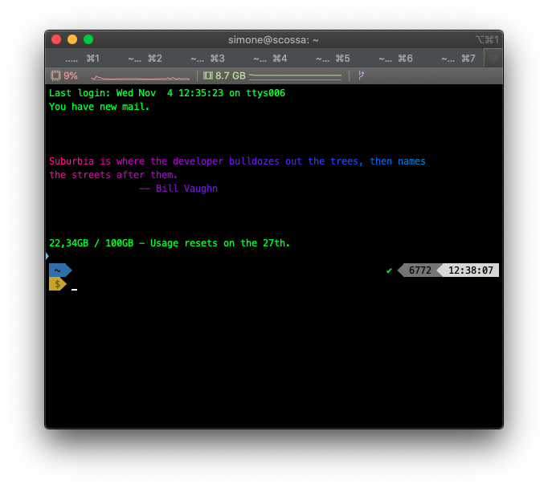

# iliad-usage-checker

Selenium bot to check my data usage at home, using Iliad's website.
This works by exploiting the Selenium APIs to fetch the `/account` page. Notice that there's no need to login if we're connected via Iliad's network.
Therefore, before doing anything, the bot checks if we're connected to the home WiFi.
If everything's alright, it fetches the data usage and writes it to a file. This was made to be added as a cronjob and `cat` the file when a new shell is created.

## Usage

### Fetching the files

Just clone the repository with

```
$ git clone https://github.com/montali/iliad-usage-checker
```

Then install the pip requirements:

```
$ pip install -r requirements.txt
```

### Adding the cronjob

You can then add this script to your crontable:

```
$ crontab -e
```

with, maybe, a waiting time of 4 hours between each execution:

```
0 */4 * * * python /Users/Simone/Progetti/iliad-usage-checker/checker.py -w BigBadW0lf -f ~/.iliad.usage
```

Note that there are two args: `-w` is the Iliad WiFi name, `-f` is the file where the data usage will be saved.
You may have problems caused by the fucked way in which `cron` handles the PATH and geckodriver. To solve that, just add

```
PATH=$PATH:/usr/local/bin/
```

on top of the crontab.

### Printing the file

Now, just edit your bashrc or whatever else shell rc you're using, by simply adding a `cat`:

```
cat ~/.iliad.usage
```

## TODO

I'd like to make this ISP-generic. Another thing that would be useful is printing the remaining days and some stats. I'll work on that someday.

Please contribute!
